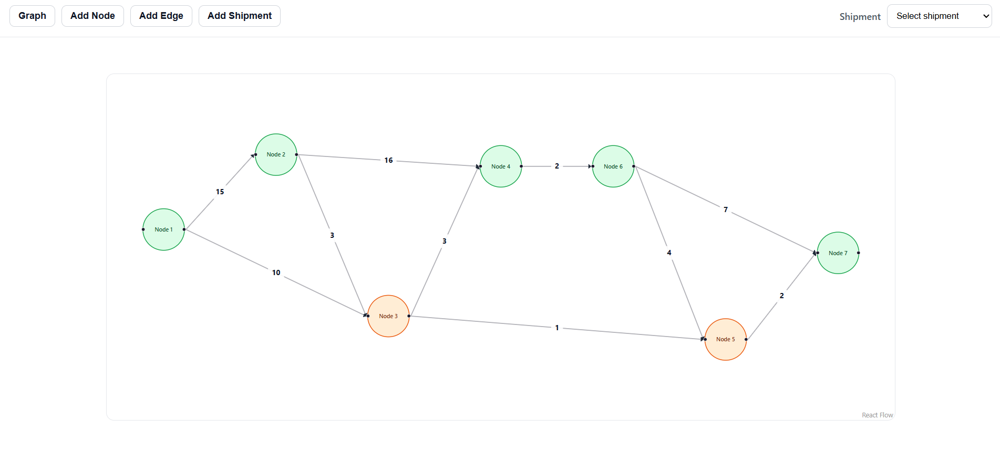
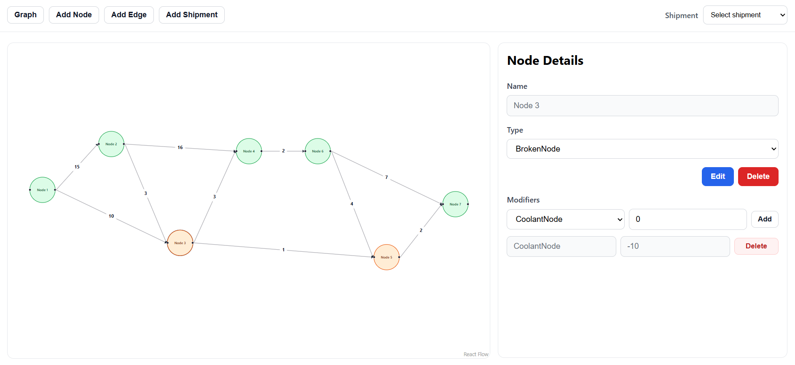
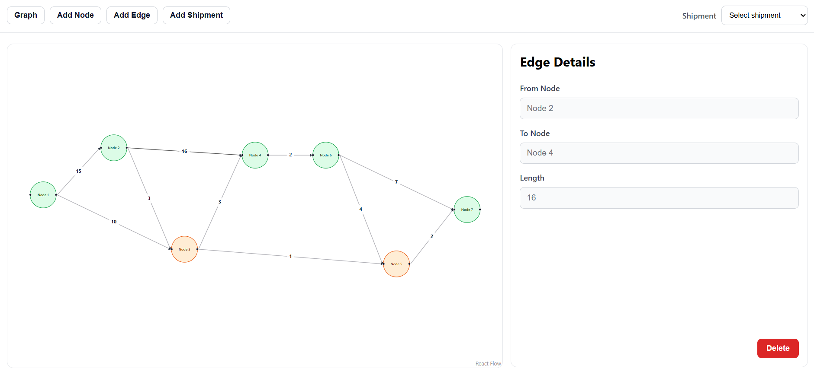
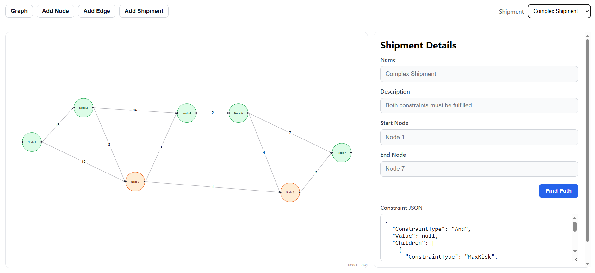
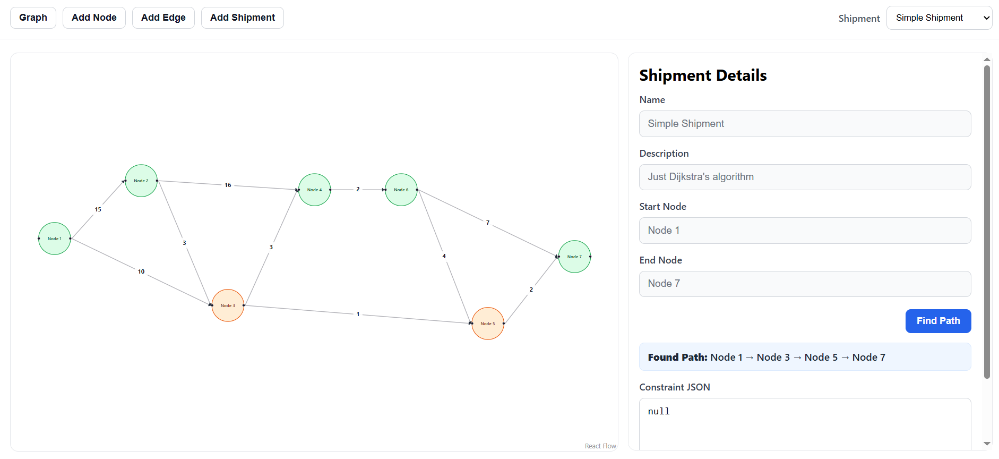
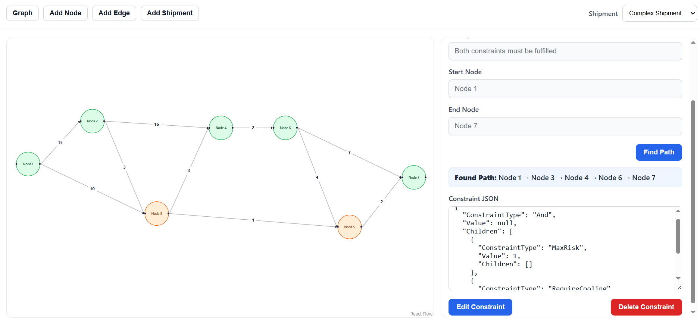
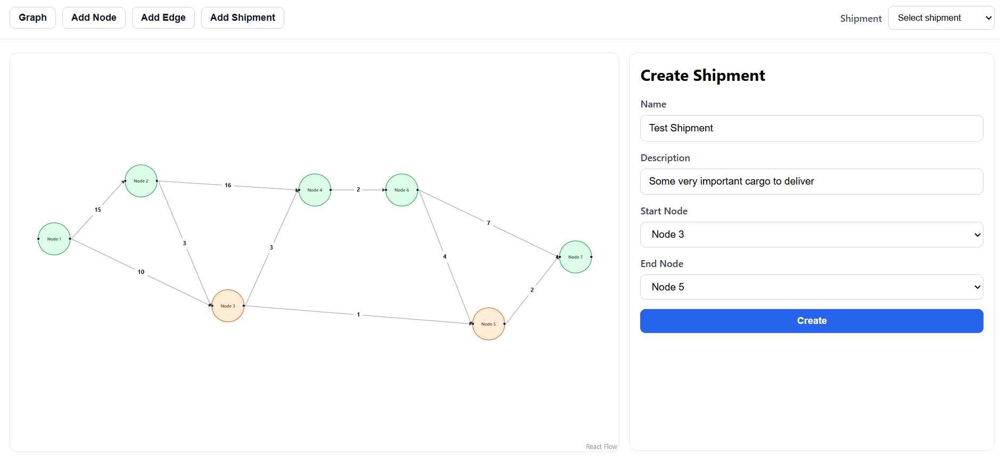

# PathFinder Project

## Summary
**PathFinder** is an app that allows users to explore optimal shipments pathing when constraints are added to a graph network. The system provides multiple types of node types, node modifiers and shipment constraints, which can all impact the result of the pathfinding algorithm.

## Entities
The core **entities** (or models) in the system are as follows:
- **Nodes** - represent graph nodes of different types.
- **Edges** - represent weighted graph edges.
- **Shipments** - define the start and end point of a pathfinding call and any additional constraints.
- **Shipment Constraints** - modify the behaviour of the pathfinding algorithm by adding restrictions that must be followed.
- **Node Modifiers** - add additional capabilities to nodes that allows them to fulfill the constraints.

## Architectural choices
The system uses a client-server model, implemented using ReactJs and ASP.NET.
The high-level architecture defines four distinct layers:
- **Client** - the client application which queries the ASP.NET Web API.
- **Web API** - server-side Web layer which is responsible for managing endpoints, data parsing and calling the appropriate services.
- **Services** - contain the primary business logic of the application, and handle data access via the Data layer.
- **Data** - establish the data models, seed initial data examples and provide access via **Repository Pattern**.

The **Service** layer implements two polymorphic hierarchies - Nodes and Constraints. This allows the pathfinding algorithm to work without any knowledge of the underlying implementations for the different types of nodes and constraints.

The base `abstract class Node` exposes an abstract method that receives `PathFindingContext` which can be modified to influence the pathfinding algorithm.

The base `abstract class ShipmentConstraint` exposes an abstract method `IsSatisfied` that receives the current `PathFindingContext` and `Node` element and returns whether that constraint is satisfied or not.

Additionally, the use of **Factory Pattern** decouples any of the services from the two hierarchies and enables a quick and easy way to extend them without changing the logic of the pathfinding algorithm.

Another architectural choice is the use of **Composite Pattern** for the Constraints, allowing the creation of more complex types of restrictions with the help of "And" and "Or" constraints, which combine multiple sub-constraints into one and require either all constraints or at least one constraint to be satisfied. Their `IsSatisfied` method recursively calls the sub-constraints' methods without any knowledge of their concrete types, making use of the polymorphic hierarchy and composite structure.

## Guide:
The app's home page loads the stored graph and displays it with the help of the ReactFlow library. Nodes are colored based on their type:
- Normal Nodes: Green
- Broken Nodes: Yellow
   


By clicking on a node, you can open its side page, which allows you to edit the node type and add/remove any of its modifiers. Modifiers types must be unique! (You cannot have two different CoolantNode modifiers for example)



By clicking on an edge, you can open its side page. For now it only allows for the edge to be deleted. Later, modify functionality will be added to it, too.



In the upper right corner of the screen, there is a dropdown menu for accessing any of the already created shipments. By selecting a desired shipment, you are sent to its side page. The shipment's name, description with additional information, start and end node are displayed there. 



The Find Path button makes the API call to retrieve the shipment's optimal path from the start to the end node. Provided there are no constraints, that would be just the result of performing Uniform Cost Search algorithm (Dijkstra's algorithm with added early stop) on the given graph.



When constraints are added, the algorithm applied has to make sure they are fulfilled. In the example we have an `And` Constraint that combines two smaller constraints. The combined constraints are for `MaxRisk` (max number of broken nodes on the path) with a value of `1` and `RequireCooling` (nodes must be provided with cooling capabilities that are lower or equal to the required value) with a value of `-5`. Nodes 1, 3, 4, 6 and 7 all have modifier for `CoolingNode` with value equal to `-10` and Node 5 has cooling `-5`. The shortest path is 1 -> 3 -> 5 -> 7 but since the `MaxRisk` constraint would not be fulfilled, the answer becomes a slightly longer path: 1 -> 3 -> 4 -> 6 -> 7.



Nodes, Edges and Shipments can be created by selecting any of the Add buttons in the header and filling the necessary data.



## Notes:
The project is still in development. Most of the business logic is complete but there is room for refactoring and additional validation and exception handling.

The Web API and Client are still not complete and require additional work. Due to the complexity of the Composite Pattern and its difficult modification in the Client, it currently supports only JSON visualization and needs to be edited as text. Below is an example that it must follow:

```json
{
  "ConstraintType": "And",
  "Value": null,
  "Children": [
    {
      "ConstraintType": "MaxRisk",
      "Value": 2
    },
    {
      "ConstraintType": "MaxLength",
      "Value": 50
    }
  ]
}
```

The allowed constraint types are `"And"`, `"Or"`, `"MaxRisk"`, `"MaxLength"`, `"RequireCooling"`, `"Special"`.

Future plans:
- Add unit testing to the service layer
- Add **Strategy Pattern** for selection of pathfinding algorithms
- Create registration system and ability to store different graphs
- Refactor code and add additional validations
- Explore separation into microservices
- Add circuit-breaker and load balancing when hosted